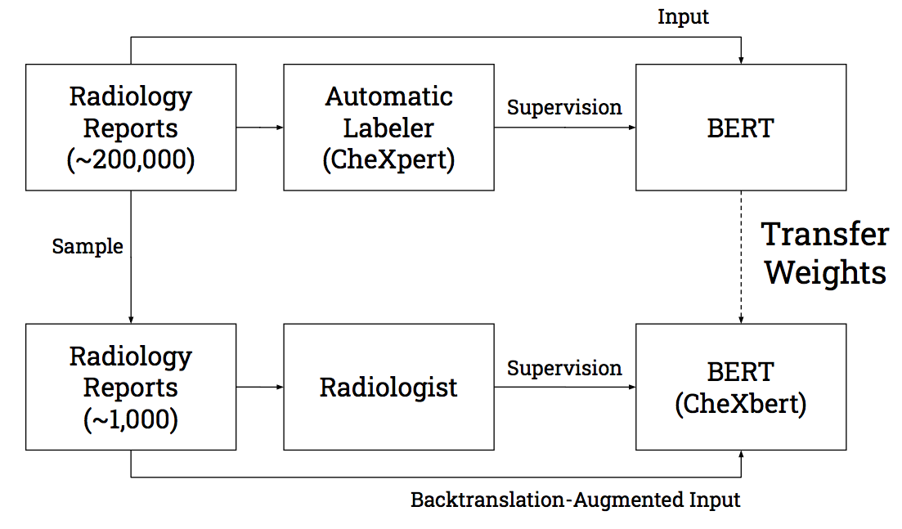

# CheXbert: Combining Automatic Labelers and Expert Annotations for Accurate Radiology Report Labeling Using BERT

CheXbert is an accurate, automated deep-learning based chest radiology report labeler that can label for the following 14 medical observations: Fracture, Consolidation, Enlarged Cardiomediastinum, No Finding, Pleural Other, Cardiomegaly, Pneumothorax, Atelectasis, Support Devices, Edema, Pleural Effusion, Lung Lesion, Lung Opacity

Paper (Accepted to EMNLP 2020): https://arxiv.org/abs/2004.09167

License from us (For Commercial Purposes): http://techfinder2.stanford.edu/technology_detail.php?ID=43869

## Abstract

The extraction of labels from radiology text reports enables large-scale training of medical imaging models. Existing approaches to report labeling typically rely either on sophisticated feature engineering based on medical domain knowledge or manual annotations by experts. In this work, we introduce a BERT-based approach to medical image report labeling that exploits both the scale of available rule-based systems and the quality of expert annotations. We demonstrate superior performance of a biomedically pretrained BERT model first trained on annotations of a rulebased labeler and then finetuned on a small set of expert annotations augmented with automated backtranslation. We find that our final model, CheXbert, is able to outperform the previous best rules-based labeler with statistical significance, setting a new SOTA for report labeling on one of the largest datasets of chest x-rays.



## Prerequisites 
(Recommended) Install requirements, with Python 3.7 or higher, using pip.

```
pip install -r requirements.txt
```

OR

Create conda environment

```
conda env create -f environment.yml
```

Activate environment

```
conda activate chexbert
```

By default, all available GPU's will be used for labeling in parallel. If there is no GPU, the CPU is used. You can control which GPU's are used by appropriately setting CUDA_VISIBLE_DEVICES. The batch size by default is 18 but can be changed inside constants.py

## Checkpoint download

Download our trained model checkpoint here: https://stanfordmedicine.box.com/s/c3stck6w6dol3h36grdc97xoydzxd7w9.

This model was first trained on ~187,000 MIMIC-CXR radiology reports labeled by the CheXpert labeler and then further trained on a separate set of 1000 radiologist-labeled reports from the MIMIC-CXR dataset, augmented with backtranslation. The MIMIC-CXR reports are deidentified and do not contain PHI. This model differs from the one in our paper, which was instead trained on radiology reports from the CheXpert dataset.

## Usage

### Label reports with CheXbert

Put all reports in a csv file under the column name "Report Impression". Let the path to this csv be {path to reports}. Download the PyTorch checkpoint and let the path to it be {path to checkpoint}. Let the path to your desired output folder by {path to output dir}. 

```
python label.py -d={path to reports} -o={path to output dir} -c={path to checkpoint} 
```

The output file with labeled reports is {path to output dir}/labeled_reports.csv

Run the following for descriptions of all command line arguments:

```
python label.py -h
```

**Ignore any error messages about the size of the report exceeding 512 tokens. All reports are automatically cut off at 512 tokens.**

### Train a model on labeled reports

Put all train/dev set reports in csv files under the column name "Report Impression". The labels for each of the 14 conditions should be in columns with the corresponding names, and the class labels should follow the convention described in this README.

Training is a two-step process. First, you must tokenize and save all the report impressions in the train and dev sets as lists:

```
python bert_tokenizer.py -d={path to train/dev reports csv} -o={path to output list}
```

After having saved the tokenized report impressions lists for the train and dev sets, you can run training as follows. You can modify the batch size or learning rate in ```constants.py```

```
python run_bert.py --train_csv={path to train reports csv} --dev_csv={path to dev reports csv} --train_imp_list={path to train impressions list} --dev_imp_list={path to dev impressions list} --output_dir={path to checkpoint saving directory}
```

The above command will initialize BERT-base weights and then train the model. If you want to initialize the model with BlueBERT or BioBERT weights (or potentially any other pretrained weights) then you should download their checkpoints, convert them to pytorch using the HuggingFace transformers command line utility (https://huggingface.co/transformers/converting_tensorflow_models.html), and provide the path to the checkpoint folder in the ```PRETRAIN_PATH``` variable in ```constants.py```. Then run the above command.

If you wish to train further from an existing CheXbert checkpoint you can run:

```
python run_bert.py --train_csv={path to train reports csv} --dev_csv={path to dev reports csv} --train_imp_list={path to train impressions list} --dev_imp_list={path to dev impressions list} --output_dir={path to checkpoint saving directory} --checkpoint={path to existing CheXbert checkpoint}
```

# Label Convention

The labeler outputs the following numbers corresponding to classes. This convention is the same as that of the CheXpert labeler.

- Blank: NaN
- Positive: 1
- Negative: 0
- Uncertain: -1

# Citation

If you use the CheXbert labeler in your work, please cite our paper:

```
@misc{smit2020chexbert,
	title={CheXbert: Combining Automatic Labelers and Expert Annotations for Accurate Radiology Report Labeling Using BERT},
	author={Akshay Smit and Saahil Jain and Pranav Rajpurkar and Anuj Pareek and Andrew Y. Ng and Matthew P. Lungren},
	year={2020},
	eprint={2004.09167},
	archivePrefix={arXiv},
	primaryClass={cs.CL}
}
```
